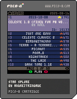

# STAR SPLORE

)

A launcher for PICO-8 featured carts, ranked by stars.

## How to play

You can use the launcher online at the [Lexaloffle BBS](https://www.lexaloffle.com/bbs/?tid=151129).

You can also download the [cart](exports/cart/) to play offline if you have PICO-8.

## PICO-8

If you want to know more about PICO-8, check the [PICO-8 landing page](https://www.lexaloffle.com/pico-8.php) or its [FAQ](https://www.lexaloffle.com/pico-8.php?page=faq).
 
## Pull requests

This project is mostly done. Therefore, I'm not accepting pull requests for this one.
 
## Files and Folders

- **star_splore.p8**: PICO-8 source code, containing graphics, sound and code.
- **inc/**: lua files included in the star_splore.p8 file.
- **tools/write_extra_carts.p8**: tool that writes extra metadata to star_splore.p8 ROM (GFX/MAP).
- **exports/cart/star_splore.p8.png**: image with the compressed cartridge embedded into it, playable in PICO-8.
- **scraper/**: the scraper used to collect featured carts information from the [Lexaloffle BBS](https://www.lexaloffle.com/bbs/) and game genres from [NerdyTeachers' Curated PICO-8 Games](https://nerdyteachers.com/PICO-8/Games/).
- **posts/**: drafts of topics to be posted on the BBS, including screenshots and GIFs.

## Notes

- This project was uploaded to GitHub when it was almost done, so do not expect much from commit history.
