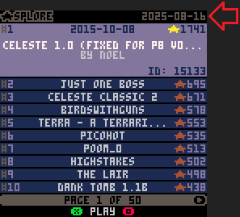

# STAR SPLORE

It's like browsing "Featured Carts" in **SPLORE**... But they are ranked by **STAR**s!

# Controls

- ⬅️ ➡️: previous / next page
- ⬆️ ⬇️: previous / next cart
- ❎: run cart
- 🅾️: filter by **GAME GENRE** or by **YEAR**

After you are done with the cart, enter the pause menu and select the last option, `back to ★SPLORE`.

# About

**STAR SPLORE** aims to help you discover some of the best PICO-8 carts ever made.

- That's why only featured carts are included.
- That's also why carts are ranked by stars, the BBS version of "likes".
- Game genres are obtained from [@NerdyTeachers](https://www.lexaloffle.com/bbs/?uid=25898)' excelent [Curated PICO-8 Games](https://nerdyteachers.com/PICO-8/Games/) list.

As imperfect as these metrics may be, they are the ones we have.

*Note: when carts are tied for stars, newer carts rank higher.*

# Why

**STAR SPLORE** was inspired by [@NerdyTeachers](https://www.lexaloffle.com/bbs/?uid=25898)' great [200 Best PICO-8 Games](https://nerdyteachers.com/PICO-8/Games/Top200/) list.

As of August 2025, there are almost 10,000 carts marked as "Releases" on the BBS. It may be tough to know where to start.

Even limiting the search to the current 500 or so featured carts, it can be nice to start with the most celebrated ones. That's where the stars ranking comes in.

# Updates

New carts won't show up until **STAR SPLORE** is updated.

**STAR SPLORE** itself is a regular PICO-8 cart after all. It can't fetch newer carts from the BBS automatically.

On the top right of the screen you can see date when cart information was extrated from the BBS and from NerdyTeachers' Curated PICO-8 Games list.

*Note: when loading carts from the BBS, STAR SPLORE ignores the cart version after the ID to get the latest version of the cart.*

# Offline

**STAR SPLORE** can also run carts offline, as long as they are in the same folder. Just make sure you don't rename cart files after downloading them from the BBS.

Note that running multicarts offline can be tricky, no matter how you launch them. Please refer to [this excelente article](https://nerdyteachers.com/PICO-8/Hardware/70#multicart) from [@NerdyTeachers](https://www.lexaloffle.com/bbs/?uid=25898) for more information on the subject. Just expand section 3, "For Multicart Games".

# Scraper

On [STAR SPLORE's GitHub repository](https://github.com/andrejtrindade/star-splore) you will find the [scraper](https://github.com/andrejtrindade/star-splore/tree/main/scraper) used to extract information from Lexaloffle's BBS.

### HTML

You can browse every information and link collected for every scraped cart in [this HTML page](https://github.com/andrejtrindade/star-splore/blob/main/scraper/results/featured_carts.html) (download it and open in your browser).

### Download

The scraper also creates a [file with URLs for all featured carts scraped](https://github.com/andrejtrindade/star-splore/blob/main/scraper/results/featured_carts_urls.txt). You can use that file to download all those carts at once using [Wget](https://www.gnu.org/software/wget/).

Dumping these 500 or so games together with **STAR SPLORE** in an handheld is a great way to browse and discover some great PICO-8 games on the go, even when you are offline.

# Outlines

I managed to squeeze in a couple outlines to celebrate the launch of [PICO-8 0.2.7](https://www.lexaloffle.com/bbs/?tid=150992) earlier this month.

I also used `rrectfill()` on the page counter!
